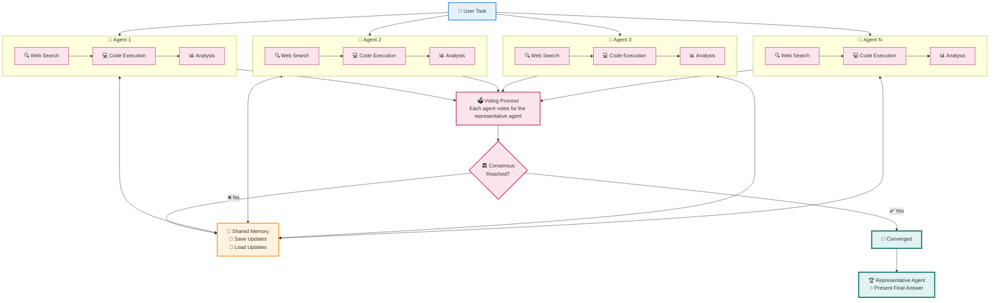

# 🚀 MASS: Multi-Agent Scaling System

[](https://www.python.org/downloads/)
[](LICENSE)


> 🧠 **Advanced multi-agent orchestration system that emulates Grok Heavy through intelligent collaboration**

MASS is a cutting-edge multi-agent system that leverages the power of collaborative AI to solve complex tasks. Multiple agents work together through:
- 🧠 **Think independently** with their own tools (search, code execution)
- 👥 **Learn from each other** in real-time by sharing and receiving updates
- 🗳️ **Vote on best solutions** through democratic consensus
- 🏆 **Deliver superior results** that combines all insights

---

## 📋 Table of Contents

- [✨ Key Features](#-key-features)
- [🏗️ How It Works](#️-how-it-works)
- [🔄 Agent Workflow](#-agent-workflow)
- [🚀 Quick Start](#-quick-start)
- [⚙️ Configuration](#️-configuration)
- [📚 Documentation](#-documentation)
- [🤝 Contributing](#-contributing)

---

## ✨ Key Features

| Feature | Description |
|---------|-------------|
| **🧠 Grok Heavy Emulation** | Multi-agent system delivering deep, comprehensive analysis |
| **⚡ Parallel Processing** | Multiple agents tackle problems simultaneously |
| **👥 Intellegience Sharing** | Agents share and learn from each other's work |
| **🗳️ Consensus Building** | Democratic voting system for solution selection |

---

## 🏗️ How It Works



MASS assigns the same task to multiple agents who work independently while observing and learning from each other's progress. This collaborative approach ensures high-quality solutions through:

- 🎯 **Independent Analysis**: Each agent develops unique perspectives
- 🔍 **Continuous Monitoring**: Real-time observation of peer progress  
- 🧩 **Knowledge Integration**: Agents incorporate insights from peers
- 🏆 **Democratic Selection**: Best solution chosen through consensus

---

## 🔄 Agent Workflow

### 🎬 Phase 1: Initial Processing
> **Objective**: Generate independent solution as starting point

```
📨 Task Received → 🧠 Processing → 📋 Summary Generated → 📢 Shared with Peers
```

**Process**:
1. 📥 Agent receives the task and processes it using `process_message()`
2. 🎯 Develops initial solution with comprehensive summary report
3. 📤 System automatically saves and shares summary with all peer agents

### 🤝 Phase 2: Collaboration & Refinement
> **Objective**: Leverage peer insights to improve solutions

```
👀 Monitor Peers → 📊 Analyze Solutions → 🤔 Decision → 🔄 Refine OR 🗳️ Vote
```

**Process**:
1. 🔍 Agent monitors peer updates every `check_update_frequency` (default: 3 seconds)
2. **Upon discovering new peer summaries**:
   - 🔄 Triggers new inference cycle to reassess situation
   - 📊 Analyzes own solution against all peer solutions
   - ⚖️ Evaluates relative quality and correctness
3. **Agent chooses action**:
   - 🔧 **Continue Working**: Incorporates insights, maintains `working` status
   - 🗳️ **Vote**: Identifies superior solution, changes status to `voted`

### 🏛️ Phase 3: Consensus Building & Debate
> **Objective**: Reach agreement through iterative review

```
📊 Consensus Check → ✅ Majority Found OR 💬 Debate → 🔄 Repeat
```

**Process**:
1. 📈 **Consensus Check**: Evaluates if results meet majority threshold
2. **Outcome Determination**:
   - ✅ **Consensus Achieved**: Majority-selected agent becomes representative
   - 🚫 **No Consensus**: Initiates structured debate with all solutions
3. 🔄 **Iterative Process**: Phases 2-3 alternate until consensus or max rounds

### 🎯 Phase 4: Final Presentation
> **Objective**: Deliver definitive solution with full context

```
🏆 Representative Selected → 📚 Review All Solutions → ✨ Final Answer
```

The selected representative receives all peer solutions and voting opinions, then synthesizes the final answer with complete reasoning and context.

---

## 🚀 Quick Start (2 minutes)

### 1. 📥 Get Started
```bash
git clone https://github.com/Leezekun/MassAgent.git
cd MassAgent
pip install -r requirements.txt
```

### 2. 🔐 Add Your API Key
```bash
cp agents/.env.example agents/.env
# Edit agents/.env with your OpenAI/XAI/Gemini API key
```

### 3. 🎉 Launch Your First Multi-Agent Team
```bash
# Try this example:
python main.py --task "Explain quantum computing to a 10-year-old" --agents 3
```

---

## ⚙️ Configuration

### 🎛️ Key Parameters

| Parameter | Description | Default | Example |
|-----------|-------------|---------|---------|
| `--agents` | Number of agents | 3 | `--agents 5` |
| `--model` | AI model to use | gpt-4 | `--model gpt-4o` |
| `--max-rounds` | Max consensus rounds | 5 | `--max-rounds 10` |
| `--check-frequency` | Peer check interval (sec) | 3 | `--check-frequency 5` |

### 📝 Example Commands

```bash
# 🔬 Scientific analysis with 5 agents
python main.py --task "Analyze climate change impacts" --agents 5 --model gpt-4o

# 💼 Business strategy with custom settings
python main.py --task "Create marketing strategy" --agents 4 --max-rounds 8

# 🎨 Creative writing collaboration
python main.py --task "Write a short story" --agents 3 --check-frequency 2
```

---

## 🤝 Contributing

We welcome contributions! Please see our [Contributing Guidelines](CONTRIBUTING.md) for details.

---

## 📄 License

This project is licensed under the MIT License - see the [LICENSE](LICENSE) file for details.

---

<div align="center">

**⭐ Star this repo if you find it useful! ⭐**

Made with ❤️ by the MASS team

</div>