# 🚀 MASS: Multi-Agent Scaling System

[](https://www.python.org/downloads/)
[](LICENSE)


> 🧠 **Advanced multi-agent orchestration system that emulates Grok Heavy through intelligent collaboration**

MASS is a cutting-edge multi-agent system that leverages the power of collaborative AI to solve complex tasks. Multiple agents work together through:
- 🧠 **Think independently** with their own tools (search, code execution)
- 👥 **Learn from each other** in real-time by sharing and receiving updates
- 🗳️ **Vote on best solutions** through democratic consensus
- 🏆 **Deliver superior results** that combines all insights

---

## 📋 Table of Contents

- [✨ Key Features](#-key-features)
- [🏗️ How It Works](#️-how-it-works)
- [🔄 Agent Workflow](#-agent-workflow)
- [🚀 Quick Start](#-quick-start)
- [⚙️ Configuration](#️-configuration)
- [📚 Documentation](#-documentation)
- [🤝 Contributing](#-contributing)

---

## ✨ Key Features

| Feature | Description |
|---------|-------------|
| **🧠 Grok Heavy Emulation** | Multi-agent system delivering deep, comprehensive analysis |
| **⚡ Parallel Processing** | Multiple agents tackle problems simultaneously |
| **👥 Intellegience Sharing** | Agents share and learn from each other's work |
| **🗳️ Consensus Building** | Democratic voting system for solution selection |

---

## 🏗️ How It Works

## 🏗️ How It Works




```mermaid
graph TB
    %% User Input
    U[👤 User Task]
    
    %% Agent 1 Sequential Block
    subgraph A1_Block [🤖 Agent 1]
        A1_Search[🔍 Web Search]
        A1_Code[💻 Code Execution]
        A1_Analysis[📊 Analysis]
        A1_Search --> A1_Code
        A1_Code --> A1_Analysis
    end
    
    %% Agent 2 Sequential Block  
    subgraph A2_Block [🤖 Agent 2]
        A2_Search[🔍 Web Search]
        A2_Code[💻 Code Execution]
        A2_Analysis[📊 Analysis]
        A2_Search --> A2_Code
        A2_Code --> A2_Analysis
    end
    
    %% Agent 3 Sequential Block
    subgraph A3_Block [🤖 Agent 3]
        A3_Search[🔍 Web Search]
        A3_Code[💻 Code Execution] 
        A3_Analysis[📊 Analysis]
        A3_Search --> A3_Code
        A3_Code --> A3_Analysis
    end
    
    %% Agent N Sequential Block
    subgraph AN_Block [🤖 Agent N]
        AN_Search[🔍 Web Search]
        AN_Code[💻 Code Execution]
        AN_Analysis[📊 Analysis]
        AN_Search --> AN_Code
        AN_Code --> AN_Analysis
    end
    
    %% User task triggers all agents
    U --> A1_Block
    U --> A2_Block
    U --> A3_Block
    U --> AN_Block
    
    %% Shared Memory Hub
    SM[🧠 Shared Memory<br/>💾 Save Updates<br/>📖 Load Updates]
    
    %% Agents interact with shared memory
    A1_Block <--> SM
    A2_Block <--> SM
    A3_Block <--> SM
    AN_Block <--> SM
    
    %% Voting Process
    V[🗳️ Voting Process<br/>Each agent votes for the representative agent]
    
    %% Agents participate in voting
    A1_Block --> V
    A2_Block --> V
    A3_Block --> V
    AN_Block --> V
    
    %% Final Answer by Representative Agent
    V --> F[🏆 Representative Agent<br/>✨Present Final Answer]
    
    %% Styling
    classDef userNode fill:#e3f2fd,stroke:#1976d2,stroke-width:2px
    classDef agentNode fill:#f3e5f5,stroke:#7b1fa2,stroke-width:2px
    classDef agentSubNode fill:#fce4ec,stroke:#ad1457,stroke-width:1px
    classDef memoryNode fill:#fff3e0,stroke:#f57c00,stroke-width:2px
    classDef voteNode fill:#fce4ec,stroke:#c2185b,stroke-width:2px
    classDef finalNode fill:#e0f2f1,stroke:#00695c,stroke-width:3px
    
    class U userNode
    class A1_Search,A1_Code,A1_Analysis,A2_Search,A2_Code,A2_Analysis,A3_Search,A3_Code,A3_Analysis,AN_Search,AN_Code,AN_Analysis agentSubNode
    class SM memoryNode
    class V voteNode
    class F finalNode
```

MASS assigns the same task to multiple agents who work independently while observing and learning from each other's progress. This collaborative approach ensures high-quality solutions through:

- 🎯 **Independent Analysis**: Each agent develops unique perspectives
- 🔍 **Continuous Monitoring**: Real-time observation of peer progress  
- 🧩 **Knowledge Integration**: Agents incorporate insights from peers
- 🏆 **Democratic Selection**: Best solution chosen through consensus

---

## 🚀 Quick Start (2 minutes)

### 1. 📥 Get Started
```bash
git clone https://github.com/Leezekun/MassAgent.git
cd MassAgent
pip install -r requirements.txt
```

### 2. 🔐 Add Your API Key
```bash
cp agents/.env.example agents/.env
# Edit agents/.env with your OpenAI/XAI/Gemini API key
```

### 3. 🎉 Launch Your First Multi-Agent Team
```bash
# Try this example:
python main.py --task "Explain quantum computing to a 10-year-old" --agents 3
```

---

## ⚙️ Configuration

### 🎛️ Key Parameters

| Parameter | Description | Default | Example |
|-----------|-------------|---------|---------|
| `--agents` | Number of agents | 3 | `--agents 5` |
| `--model` | AI model to use | gpt-4 | `--model gpt-4o` |
| `--max-rounds` | Max consensus rounds | 5 | `--max-rounds 10` |
| `--check-frequency` | Peer check interval (sec) | 3 | `--check-frequency 5` |

### 📝 Example Commands

```bash
# 🔬 Scientific analysis with 5 agents
python main.py --task "Analyze climate change impacts" --agents 5 --model gpt-4o

# 💼 Business strategy with custom settings
python main.py --task "Create marketing strategy" --agents 4 --max-rounds 8

# 🎨 Creative writing collaboration
python main.py --task "Write a short story" --agents 3 --check-frequency 2
```

---

## 🤝 Contributing

We welcome contributions! Please see our [Contributing Guidelines](CONTRIBUTING.md) for details.

---

## 📄 License

This project is licensed under the MIT License - see the [LICENSE](LICENSE) file for details.

---

<div align="center">

**⭐ Star this repo if you find it useful! ⭐**

Made with ❤️ by the MASS team

</div>