# 🚀 MASS: Multi-Agent Scaling System

[](https://www.python.org/downloads/)
[](LICENSE)

> 🧠 **Advanced multi-agent orchestration system that emulates Grok Heavy through intelligent collaboration**

MASS is a cutting-edge multi-agent system that leverages the power of collaborative AI to solve complex tasks. It assigns a task to multiple AI agents who work in parallel, observe each other's progress, and refine to converge to the best solution to deliver a comprehensive and high-quality result.

---

## 📋 Table of Contents

- [✨ Key Features](#-key-features)
- [🏗️ How It Works](#️-how-it-works)
- [🚀 Quick Start](#-quick-start)
- [🤝 Contributing](#-contributing)

---

## ✨ Key Features

| Feature | Description |
|---------|-------------|
| **🧠 Grok Heavy Emulation** | Multi-agent system delivering deep, comprehensive analysis |
| **⚡ Parallel Processing** | Multiple agents tackle problems simultaneously |
| **👥 Intelligence Sharing** | Agents share and learn from each other's work |
| **🔄 Consensus Building** | Natural convergence through collaborative refinement |

---

## 🏗️ Architecture

```mermaid
graph TB
    O[🚀 MASS Orchestrator<br/>📋 Task Distribution & Coordination]

    A1[🤖 Agent 1<br/>🏗️ Anthropic/Claude<br/>📝 Working Summary]
    A2[🤖 Agent 2<br/>🌟 Google/Gemini<br/>📝 Working Summary]
    A3[🤖 Agent 3<br/>🤖 OpenAI/GPT + Tools<br/>📝 Working Summary]
    A4[🤖 Agent 4<br/>⚡ xAI/Grok + Search<br/>📝 Working Summary]

    H[🔄 Shared Collaboration Hub<br/>📡 Real-time Notification System<br/>🎯 Convergence Detection<br/>🤝 Consensus Building]

    O --> A1
    O --> A2
    O --> A3
    O --> A4

    A1 <--> H
    A2 <--> H
    A3 <--> H
    A4 <--> H

    A1 -.-> A2
    A1 -.-> A3
    A1 -.-> A4
    A2 -.-> A3
    A2 -.-> A4
    A3 -.-> A4

    classDef orchestrator fill:#e1f5fe,stroke:#0288d1,stroke-width:3px
    classDef agent fill:#f3e5f5,stroke:#7b1fa2,stroke-width:2px
    classDef hub fill:#e8f5e8,stroke:#388e3c,stroke-width:2px
    classDef collaboration stroke:#ff9800,stroke-width:1px,stroke-dasharray: 5 5

    class O orchestrator
    class A1,A2,A3,A4 agent
    class H hub
```



## 🏗️ How It Works

MASS operates through **seamless multi-agent collaboration**:

**Parallel Processing** - Multiple agents tackle the same task simultaneously, each leveraging their unique capabilities (different models, tools, and specialized approaches).

**Real-time Collaboration** - Agents continuously share their working summaries and insights through a notification system, allowing them to learn from each other's approaches and build upon collective knowledge.

**Convergence Detection** - The system intelligently monitors when agents have reached stability in their solutions and achieved consensus through natural collaboration rather than forced agreement.

**Adaptive Coordination** - Agents can restart and refine their work when they receive new insights from others, creating a dynamic and responsive problem-solving environment.

This collaborative approach ensures that the final output leverages collective intelligence from multiple AI systems, leading to more robust and well-rounded results than any single agent could achieve alone.

---

## 🚀 Quick Start

### 1. 📥 Installation

```bash
git clone https://github.com/Leezekun/MassAgent.git
cd MassAgent
pip install -r requirements.txt
```

### 2. 🔐 API Configuration

Create a `.env` file in the `agents/` directory with your API keys:

```bash
# Copy example configuration
cp agents/.env.example agents/.env

# Edit agents/.env with your API keys
OPENAI_API_KEY=sk-your-openai-key-here
XAI_API_KEY=xai-your-xai-key-here
GEMINI_API_KEY=your-gemini-key-here
```

### 3. 🏃 Run Example

```bash
# Run simple multi-agent example
python mass_main.py --config example_config.json

# Or run with custom task
python cli.py --question "2312312 * (142342 + 222552) = ?" --agents o4-mini,gemini-2.5-flash,grok-4
```

### 4. 📊 View Results

The system will show real-time collaboration between agents and present the final converged solution.

---

## ⚠️ Project Status

> **Early Development Stage** - This project is currently in active development and requires significant improvements.

### Current Limitations

- **Basic Implementation**: The current system provides an early prototype but lacks the sophisticated features planned for the full MASS system
- **Limited Model Support**: Claude/Anthropic integration is planned but not yet implemented (Gemini, OpenAI, and xAI/Grok are currently supported)
- **Simple Collaboration**: Current notification and convergence mechanisms need enhancement for seamless real-time collaboration
- **Resource Management**: System needs better streaming optimization and performance improvements for smooth multi-agent coordination

### 🔮 Future Direction

This project is evolving toward the **advanced MASS architecture** found in `future_mass/`, which includes:

- **Enhanced Agent Interface**: Sophisticated `update_summary()`, `check_updates()`, and notification systems
- **Comprehensive Backend Support**: Full integration with Claude, Gemini, GPT, Grok + tools and MCP servers
- **Rich Analytics & Tracing**: Detailed performance analysis, cost tracking, and API tracing capabilities
- **Extensible Framework**: Modular design for easy addition of new agents, benchmarks, and evaluation; integration with AgentOS like [AG2](ag2.ai).

### 📋 Planned Improvements

- [ ] Implement advanced agent collaboration patterns in `future_mass/`
- [ ] Add comprehensive tool integration and MCP server support
- [ ] Enhance streaming display system with better formatting
- [ ] Implement proper cost tracking and budget management
- [ ] Add benchmarking framework for evaluation
- [ ] Improve error handling and graceful failure recovery
- [ ] Add web interface for better visualization and control

### 📋 TODO

- [x] Fix Grok Fake Stream
- [x] (optional) Convert Gemini from Request to API
- [x] Add function call feature to backends
- [x] The backends should support both their built-in tools (if exists) and provided custom tools
- [ ] Re-design the Agent Class, with the running config (temperaute, top_p) intialized, and add a work_on_task function
- [ ] Change the workflow from system maintained to agent maintain
- [ ] (optional) Add Claude and Fireworks backend
- [ ] (optional) Add more tools (DuckDuckGo Search, and calculators)


**Contributions Welcome!** We encourage developers to help bridge the gap between the current implementation and the target architecture.

---

## 🤝 Contributing

We welcome contributions! Please see our [Contributing Guidelines](CONTRIBUTING.md) for details.

---

## 📄 License

This project is licensed under the Apache License 2.0 - see the [LICENSE](LICENSE) file for details.

---

<div align="center">

**⭐ Star this repo if you find it useful! ⭐**

Made with ❤️ by the MASS team

</div>
