<p align="center">
  
</p>

<p align="center">
  <a href="https://www.python.org/downloads/">
    
  </a>
  <a href="LICENSE">
    
  </a>
  <a href="https://discord.gg/VVrT2rQaz5">
    
  </a>
</p>

<h1 align="center">🚀 MassGen: Multi-Agent Scaling System for GenAI</h1>

<p align="center">
  <i>MassGen is a cutting-edge multi-agent system that leverages the power of collaborative AI to solve complex tasks.</i>
</p>

<p align="center">
  <a href="https://youtu.be/eMBdoAYeujw">
    
  </a>
</p>


<!-- <div align="center">
  
</div> -->

> 🧠 **Multi-agent scaling through intelligent collaboration in Grok Heavy style**

MassGen is a cutting-edge multi-agent system that leverages the power of collaborative AI to solve complex tasks. It assigns a task to multiple AI agents who work in parallel, observe each other's progress, and refine their approaches to converge on the best solution to deliver a comprehensive and high-quality result. The power of this "parallel study group" approach is exemplified by advanced systems like xAI's Grok Heavy and Google DeepMind's Gemini Deep Think.
This project started with the "threads of thought" and "iterative refinement" ideas presented in [The Myth of Reasoning](https://docs.ag2.ai/latest/docs/blog/#the-myth-of-reasoning), and extends the classic "multi-agent conversation" idea in [AG2](https://github.com/ag2ai/ag2).

---

## 📋 Table of Contents

- [✨ Key Features](#-key-features)
- [🏗️ System Design](#️-system-design)
- [🚀 Quick Start](#-quick-start)
- [💡 Examples](#-examples)
- [🤝 Contributing](#-contributing)

---

## ✨ Key Features

| Feature | Description |
|---------|-------------|
| **🤝 Cross-Model/Agent Synergy** | Harness strengths from diverse frontier model-powered agents |
| **⚡ Parallel Processing** | Multiple agents tackle problems simultaneously |
| **👥 Intelligence Sharing** | Agents share and learn from each other's work |
| **🔄 Consensus Building** | Natural convergence through collaborative refinement |
| **📊 Live Visualization** | See agents' working processes in real-time |

---

## 🏗️ System Design

MassGen operates through a sophisticated architecture designed for **seamless multi-agent collaboration**:

```mermaid
graph TB
    O[🚀 MassGen Orchestrator<br/>📋 Task Distribution & Coordination]

    subgraph Collaborative Agents
        A1[Agent 1<br/>🏗️ Anthropic/Claude + Tools]
        A2[Agent 2<br/>🌟 Google/Gemini + Tools]
        A3[Agent 3<br/>🤖 OpenAI/GPT/O + Tools]
        A4[Agent 4<br/>⚡ xAI/Grok + Tools]
    end

    H[🔄 Shared Collaboration Hub<br/>📡 Real-time Notification & Consensus]

    O --> A1 & A2 & A3 & A4
    A1 & A2 & A3 & A4 <--> H

    classDef orchestrator fill:#e1f5fe,stroke:#0288d1,stroke-width:3px
    classDef agent fill:#f3e5f5,stroke:#7b1fa2,stroke-width:2px
    classDef hub fill:#e8f5e8,stroke:#388e3c,stroke-width:2px

    class O orchestrator
    class A1,A2,A3,A4 agent
    class H hub
```



The system's workflow is defined by the following key principles:

**Parallel Processing** - Multiple agents tackle the same task simultaneously, each leveraging their unique capabilities (different models, tools, and specialized approaches).

**Real-time Collaboration** - Agents continuously share their working summaries and insights through a notification system, allowing them to learn from each other's approaches and build upon collective knowledge.

**Convergence Detection** - The system intelligently monitors when agents have reached stability in their solutions and achieved consensus through natural collaboration rather than forced agreement.

**Adaptive Coordination** - Agents can restart and refine their work when they receive new insights from others, creating a dynamic and responsive problem-solving environment.

This collaborative approach ensures that the final output leverages collective intelligence from multiple AI systems, leading to more robust and well-rounded results than any single agent could achieve alone.

---

## 🚀 Quick Start

### 1. 📥 Installation

```bash
git clone https://github.com/Leezekun/MassGen.git
cd MassGen
pip install uv
uv venv
source .venv/bin/activate  # On macOS/Linux
uv pip install -e .
```

### 2. 🔐 API Configuration

Create a `.env` file in the `massgen/backends/` directory with your API keys:

```bash
# Copy example configuration
cp massgen/backends/.env.example massgen/backends/.env

# Edit with your API keys
OPENAI_API_KEY=sk-your-openai-key-here
XAI_API_KEY=xai-your-xai-key-here
GEMINI_API_KEY=your-gemini-key-here
```

Make sure you set up the API key for the model you want to use.

**Useful links to get API keys:**
 - [Gemini](https://ai.google.dev/gemini-api/docs)
 - [OpenAI](https://platform.openai.com/api-keys)
 - [Grok](https://docs.x.ai/docs/overview)

### 3. 🧩 Supported Models and Tools

<!-- What does the following mean? If it can be clarified, then we can uncomment -->
<!-- Configure the models you wish to use by updating the model registry in `massgen/utils.py`.  -->

#### Models

The system currently supports three model providers with advanced reasoning capabilities: **Google Gemini**, **OpenAI**, and **xAI Grok**. The specific models tested can be found in `massgen/utils.py`. Additional models can be registered in that file.
More providers and local inference of open-sourced models (using vllm or sglang) will be added (help wanted!) and the extension will be made easier.

#### Tools

MassGen agents can leverage various tools to enhance their problem-solving capabilities. The Gemini, OpenAI, and Grok models can use their own built-in search and code execution. You can easily extend functionality by registering custom tools in `massgen/tools.py`.

**Supported Built-in Tools by Models:**

| Backend | Live Search | Code Execution |
|---------|:-----------:|:--------------:|
| **Gemini** | ✅ | ✅ |
| **OpenAI** | ✅ | ✅ |
| **Grok** | ✅ | ❌ |

> 🔧 **Custom Tools**: More tools are coming soon! Check `massgen/tools.py` to add your own custom tools and expand agent capabilities.

### 4. 🏃 Run MassGen

#### Simple Usage
```bash
# Multi-agent mode with specific models
python cli.py "Which AI won IMO in 2025?" --models gemini-2.5-flash gpt-4o

# Single agent mode
python cli.py "What is greatest common divisor of 238, 756, and 1512" --models gemini-2.5-flash
```

#### Configuration File Usage
```bash
# Use configuration file
python cli.py --config examples/fast_config.yaml "find big AI news this week"

# Override specific parameters
python cli.py --config examples/fast_config.yaml "who will win World Cup 2026" --max-duration 120 --consensus 0.5
```

#### Configuration Parameters

| Parameter | Description |
|-----------|-------------|
| `--config` | Path to YAML configuration file with agent setup, model parameters, and orchestrator settings |
| `--models` | Space-separated model names. Single model enables single-agent mode; multiple models enable collaborative multi-agent mode |
| `--consensus` | Consensus threshold (0.0-1.0) for multi-agent agreement. Unmet thresholds trigger continued debate and refinement |
| `--max-duration` | Maximum session execution time in seconds before automatic termination |
| `--max-debates` | Maximum number of debate rounds allowed when agents fail to reach consensus |
| `--no-display` | Disable real-time streaming display of agent progress |
| `--no-logs` | Disable automatic session logging to files |

**Note**: `--config` and `--models` are mutually exclusive - use one or the other.

#### Interactive Multi-turn Mode

MassGen supports an interactive mode where you can have ongoing conversations with the system:

```bash
# Start interactive mode with multiple agents
python cli.py --models gpt-4o gemini-2.5-flash grok-3-mini

# Start interactive mode with configuration file
python cli.py --config examples/fast_config.yaml

# Interactive mode with custom parameters
python cli.py --models gpt-4o grok-3-mini --consensus 0.7 --max-duration 600
```

**Interactive Mode Features:**
- **Multi-turn conversations**: Multiple agents collaborate to chat with you in an ongoing conversation
- **Real-time feedback**: Displays real-time agent and system status
- **Easy exit**: Type `quit`, `exit`, or press `Ctrl+C` to stop


### 5. 📊 View Results

The system provides multiple ways to view and analyze results:

#### Real-time Display
- **Live Collaboration View**: See agents working in parallel through a multi-region terminal display
- **Status Updates**: Real-time phase transitions, voting progress, and consensus building
- **Streaming Output**: Watch agents' reasoning and responses as they develop

#### Comprehensive Logging
All sessions are automatically logged with detailed information. The file locations are also displayed and clickable in the UI.

```bash
logs/
└── 20250123_142530/          # Session timestamp (YYYYMMDD_HHMMSS)
    ├── answers/
    │   ├── agent_1.txt       # The proposed answers by agent 1
    │   ├── agent_2.txt       # The proposed answers by agent 2
    │   └── agent_3.txt       # The proposed answers by agent 3
    ├── votes/
    │   ├── agent_1.txt       # The votes cast by agent 1
    │   ├── agent_2.txt       # The votes cast by agent 2
    │   └── agent_3.txt       # The votes cast by agent 3
    ├── display/
    │   ├── agent_1.txt       # The full log in the streaming display of agent 1
    │   ├── agent_2.txt       # The full log in the streaming display of agent 2
    │   ├── agent_3.txt       # The full log in the streaming display of agent 3
    │   └── system.txt        # The full log of system events and phase changes
    ├── console.log           # Console output and system messages
    ├── events.jsonl          # Orchestrator events and phase changes (JSONL format)
    └── result.json           # Final results and session summary
```

#### Log File Contents
- **Session Summary**: Final answer, consensus score, voting results, execution time
- **Agent History**: Complete action and chat history for each agent
- **System Events**: Phase transitions, restarts, consensus detection of the whole system

---

## 💡 Examples

Here are a few examples of how you can use MassGen for different tasks:

### Case Studies

To see how MassGen works in practice, check out these detailed case studies based on real session logs:

- [**MassGen Case Studies**](docs/case_studies/index.md)

<!-- Uncomment when we add coding agent support -->
<!-- ### 1. 📝 Code Generation

```bash
python cli.py --config examples/fast_config.yaml "Design a logo for MassGen (multi-agent scaling system for GenAI) GitHub README"
``` -->

### 1. ❓ Question Answering

```bash
# Ask a question about a complex topic
python cli.py --config examples/fast_config.yaml "Explain the theory of relativity in simple terms."
python cli.py "what's best to do in Stockholm in October 2025" --models gemini-2.5-flash gpt-4o
```

### 2. 🧠 Creative Writing

```bash
# Generate a short story
python cli.py --config examples/fast_config.yaml "Write a short story about a robot who discovers music."
```

### 3. Research
```bash
python cli.py --config examples/fast_config.yaml "How much does it cost to run HLE benchmark with Grok-4"
```

---

## 🗺️ Roadmap

MassGen is currently in its foundational stage, with a focus on parallel, asynchronous multi-agent collaboration and orchestration. Our roadmap is centered on transforming this foundation into a highly robust, intelligent, and user-friendly system, while enabling frontier research and exploration.

### Key Future Enhancements:

-   **Advanced Agent Collaboration:** Exploring improved communication patterns and consensus-building protocols to improve agent synergy.
-   **Expanded Model, Tool & Agent Integration:** Adding support for more models/tools/agents, including Claude, a wider range of tools like MCP Servers, and coding agents.
-   **Improved Performance & Scalability:** Optimizing the streaming and logging mechanisms for better performance and resource management.
-   **Enhanced Developer Experience:** Introducing a more modular agent design and a comprehensive benchmarking framework for easier extension and evaluation.
-   **Web Interface:** Developing a web-based UI for better visualization and interaction with the agent ecosystem.

We welcome community contributions to help us achieve these goals.

---

## 🤝 Contributing

We welcome contributions! Please see our [Contributing Guidelines](CONTRIBUTING.md) for details.

---

## 📄 License

This project is licensed under the Apache License 2.0 - see the [LICENSE](LICENSE) file for details.

---

<div align="center">

**⭐ Star this repo if you find it useful! ⭐**

Made with ❤️ by the MassGen team

</div>
