# 🚀 MASS: Multi-Agent Scaling System

[](https://www.python.org/downloads/)
[](LICENSE)

> 🧠 **Advanced multi-agent orchestrator that emulates Grok Heavy through intelligent collaboration**

MASS is a cutting-edge multi-agent system that leverages the power of collaborative AI to solve complex tasks. It assigns a task to multiple AI agents who work in parallel, observe each other's progress, and refine to converge to the best solution to deliver a comprehensive and high-quality result. This project is inspired by the ideas presented in [The Myth of Reasoning](https://docs.ag2.ai/latest/docs/blog/#the-myth-of-reasoning) and aims to emulate the power of systems like grok-4 heavy.

---

## 📋 Table of Contents

- [✨ Key Features](#-key-features)
- [🏗️ How It Works](#️-how-it-works)
- [🚀 Quick Start](#-quick-start)
- [🤝 Contributing](#-contributing)

---

## ✨ Key Features

| Feature | Description |
|---------|-------------|
| **🧠 Grok Heavy Emulation** | Multi-agent system delivering deep, comprehensive analysis |
| **⚡ Parallel Processing** | Multiple agents tackle problems simultaneously |
| **👥 Intelligence Sharing** | Agents share and learn from each other's work |
| **🔄 Consensus Building** | Natural convergence through collaborative refinement |
| **🔄 Multi-Region Display** | Display all agents' running process in different regions |

---

## 🏗️ Architecture

```mermaid
graph TB
    O[🚀 MASS Orchestrator<br/>📋 Task Distribution & Coordination]

    A1[🤖 Agent 1<br/>🏗️ Anthropic/Claude<br/>📝 Working Summary]
    A2[🤖 Agent 2<br/>🌟 Google/Gemini<br/>📝 Working Summary]
    A3[🤖 Agent 3<br/>🤖 OpenAI/GPT + Tools<br/>📝 Working Summary]
    A4[🤖 Agent 4<br/>⚡ xAI/Grok + Search<br/>📝 Working Summary]

    H[🔄 Shared Collaboration Hub<br/>📡 Real-time Notification System<br/>🎯 Convergence Detection<br/>🤝 Consensus Building]

    O --> A1
    O --> A2
    O --> A3
    O --> A4

    A1 <--> H
    A2 <--> H
    A3 <--> H
    A4 <--> H

    A1 -.-> A2
    A1 -.-> A3
    A1 -.-> A4
    A2 -.-> A3
    A2 -.-> A4
    A3 -.-> A4

    classDef orchestrator fill:#e1f5fe,stroke:#0288d1,stroke-width:3px
    classDef agent fill:#f3e5f5,stroke:#7b1fa2,stroke-width:2px
    classDef hub fill:#e8f5e8,stroke:#388e3c,stroke-width:2px
    classDef collaboration stroke:#ff9800,stroke-width:1px,stroke-dasharray: 5 5

    class O orchestrator
    class A1,A2,A3,A4 agent
    class H hub
```



## 🏗️ How It Works

MASS operates through **seamless multi-agent collaboration**:

**Parallel Processing** - Multiple agents tackle the same task simultaneously, each leveraging their unique capabilities (different models, tools, and specialized approaches).

**Real-time Collaboration** - Agents continuously share their working summaries and insights through a notification system, allowing them to learn from each other's approaches and build upon collective knowledge.

**Convergence Detection** - The system intelligently monitors when agents have reached stability in their solutions and achieved consensus through natural collaboration rather than forced agreement.

**Adaptive Coordination** - Agents can restart and refine their work when they receive new insights from others, creating a dynamic and responsive problem-solving environment.

This collaborative approach ensures that the final output leverages collective intelligence from multiple AI systems, leading to more robust and well-rounded results than any single agent could achieve alone.

---

## 🚀 Quick Start

### 1. 📥 Installation

```bash
git clone https://github.com/Leezekun/MassAgent.git
cd MassAgent
pip install -r requirements.txt
```

### 2. 🔐 API Configuration

Create a `.env` file in the `mass/backends/` directory with your API keys:

```bash
# Copy example configuration
cp mass/backends/.env.example mass/backends/.env

# Edit with your API keys
OPENAI_API_KEY=sk-your-openai-key-here
XAI_API_KEY=xai-your-xai-key-here
GEMINI_API_KEY=your-gemini-key-here
```

### 3. 🏃 Run MASS

#### Simple Usage
```bash
# Run with specific models
python cli.py --models gpt-4o gemini-2.5-flash "What is 2+2?"

# Mathematical calculation
python cli.py --models gpt-4o gemini-2.5-flash "2312312 * (142342 + 222552) = ?"
```

#### Configuration File Usage
```bash
# Use existing configuration file
python cli.py --config examples/production.yaml "Complex analysis question"

# Override specific parameters
python cli.py --config examples/production.yaml "Question" --max-duration 1200 --consensus 0.8
```

#### Parameter Overrides
```bash
# Customize execution parameters
python cli.py --models gpt-4o gemini-2.5-flash "Question" \
  --max-duration 1200 \
  --consensus 0.8 \
  --max-debates 5 \
  --no-display \
  --no-logs
```

### 4. 📊 View Results

The system shows real-time collaboration between agents in a multi-region display and presents the final converged solution with consensus details.

---

##  Roadmap

MASS is currently in its foundational stage, with a focus on core multi-agent collaboration and orchestration. Our roadmap is centered on enhancing this framework to build a more robust, intelligent, and user-friendly system.

### Key Future Enhancements:

-   **Advanced Agent Collaboration:** Implementing more sophisticated communication and consensus-building protocols to improve agent synergy.
-   **Expanded Model & Tool Integration:** Adding support for more models, including Claude, and integrating a wider range of tools like MCP Servers.
-   **Improved Performance & Scalability:** Optimizing the streaming and logging mechanisms for better performance and resource management.
-   **Enhanced Developer Experience:** Introducing a more modular agent design and a comprehensive benchmarking framework for easier extension and evaluation.
-   **Web Interface:** Developing a web-based UI for better visualization and interaction with the agent ecosystem.

We welcome community contributions to help us achieve these goals.

---

## 🤝 Contributing

We welcome contributions! Please see our [Contributing Guidelines](CONTRIBUTING.md) for details.

---

## 📄 License

This project is licensed under the Apache License 2.0 - see the [LICENSE](LICENSE) file for details.

---

<div align="center">

**⭐ Star this repo if you find it useful! ⭐**

Made with ❤️ by the MASS team

</div>
