# 🚀 MASS: Multi-Agent Scaling System

[](https://www.python.org/downloads/)
[](LICENSE)

<div align="center">
  <a href="https://www.youtube.com/watch?v=dQw4w9WgXcQ">
    
  </a>
</div>

> 🧠 **Next-gen multi-agent scaling through intelligent collaboration in Grok Heavy style**

MASS is a cutting-edge multi-agent system that leverages the power of collaborative AI to solve complex tasks. It assigns a task to multiple AI agents who work in parallel, observe each other's progress, and refine to converge to the best solution to deliver a comprehensive and high-quality result. This project is inspired by the "threads of thoughts" and "iterative refinement" ideas presented in [The Myth of Reasoning](https://docs.ag2.ai/latest/docs/blog/#the-myth-of-reasoning), the power of "parallel study group" demonstrated in premium commercial prodcuts like [Grok Heavy](https://x.ai/news/grok-4#grok-4-heavy), and extends the classic "multi-agent conversation" idea in [AG2](https://github.com/ag2ai/ag2).

---

## 📋 Table of Contents

- [✨ Key Features](#-key-features)
- [🏗️ System Design](#️-system-design)
- [🚀 Quick Start](#-quick-start)
- [💡 Examples](#-examples)
- [🤝 Contributing](#-contributing)

---

## ✨ Key Features

| Feature | Description |
|---------|-------------|
| **🤝 Cross-Model/Agent Synergy** | Harness strengths from diverse frontier model-powered agents |
| **⚡ Parallel Processing** | Multiple agents tackle problems simultaneously |
| **👥 Intelligence Sharing** | Agents share and learn from each other's work |
| **🔄 Consensus Building** | Natural convergence through collaborative refinement |
| **📊 Live Visualization** | See agents' working processes in real-time |

---

## 🏗️ System Design

MASS operates through a sophisticated architecture designed for **seamless multi-agent collaboration**:

```mermaid
graph TB
    O[🚀 MASS Orchestrator<br/>📋 Task Distribution & Coordination]

    subgraph Collaborative Agents
        A1[Agent 1<br/>🏗️ Anthropic/Claude]
        A2[Agent 2<br/>🌟 Google/Gemini]
        A3[Agent 3<br/>🤖 OpenAI/GPT + Tools]
        A4[Agent 4<br/>⚡ xAI/Grok + Search]
    end

    H[🔄 Shared Collaboration Hub<br/>📡 Real-time Notification & Consensus]

    O --> A1 & A2 & A3 & A4
    A1 & A2 & A3 & A4 <--> H

    classDef orchestrator fill:#e1f5fe,stroke:#0288d1,stroke-width:3px
    classDef agent fill:#f3e5f5,stroke:#7b1fa2,stroke-width:2px
    classDef hub fill:#e8f5e8,stroke:#388e3c,stroke-width:2px

    class O orchestrator
    class A1,A2,A3,A4 agent
    class H hub
```



The system's workflow is defined by the following key principles:

**Parallel Processing** - Multiple agents tackle the same task simultaneously, each leveraging their unique capabilities (different models, tools, and specialized approaches).

**Real-time Collaboration** - Agents continuously share their working summaries and insights through a notification system, allowing them to learn from each other's approaches and build upon collective knowledge.

**Convergence Detection** - The system intelligently monitors when agents have reached stability in their solutions and achieved consensus through natural collaboration rather than forced agreement.

**Adaptive Coordination** - Agents can restart and refine their work when they receive new insights from others, creating a dynamic and responsive problem-solving environment.

This collaborative approach ensures that the final output leverages collective intelligence from multiple AI systems, leading to more robust and well-rounded results than any single agent could achieve alone.

---

## 🚀 Quick Start

### 1. 📥 Installation

```bash
git clone https://github.com/Leezekun/MassAgent.git
cd MassAgent
pip install uv
uv venv
source .venv/bin/activate  # On macOS/Linux
uv pip install -e .
```

### 2. 🔐 API Configuration

Create a `.env` file in the `massgen/backends/` directory with your API keys:

```bash
# Copy example configuration
cp massgen/backends/.env.example massgen/backends/.env

# Edit with your API keys
OPENAI_API_KEY=sk-your-openai-key-here
XAI_API_KEY=xai-your-xai-key-here
GEMINI_API_KEY=your-gemini-key-here
```

### 3. 🧩 Register Models

Configure the models you wish to use by updating the model registry in `massgen/utils.py`. 

The system currently supports three model providers with advanced reasoning capabilities: **Google Gemini**, **OpenAI**, and **xAI Grok**.
More providers will be added soon.


### 4. 🏃 Run MASS

#### Simple Usage
```bash
# Multi-agent mode with specific models
python cli.py "What is greatest common divisor of 238, 756, and 1512?" --models gemini-2.5-flash gpt-4.1

# Single agent mode
python cli.py "What is greatest common divisor of 238, 756, and 1512?" --models gpt-4.1
```

#### Configuration File Usage
```bash
# Use configuration file
python cli.py --config examples/fast_config.yaml "Complex analysis question"

# Override specific parameters
python cli.py --config examples/fast_config.yaml "Question" --max-duration 120 --consensus 0.5
```

#### Interactive Multi-turn Mode

MASS supports an interactive mode where you can have ongoing conversations with the system:

```bash
# Start interactive mode with multiple agents
python cli.py --models gpt-4.1 gemini-2.5-flash grok-3-mini

# Start interactive mode with configuration file
python cli.py --config examples/fast_config.yaml

# Interactive mode with custom parameters
python cli.py --models gpt-4.1 grok-3-mini --consensus 0.7 --max-duration 600
```

**Note**: `--config` and `--models` are mutually exclusive - use one or the other.

**Interactive Mode Features:**
- **Multi-turn conversations**: Multiple agents collaborate to chat with you in an ongoing conversation
- **Real-time feedback**: Displays real-time agent and system status
- **Easy exit**: Type `quit`, `exit`, or press `Ctrl+C` to stop


### 4. 📊 View Results

The system provides multiple ways to view and analyze results:

#### Real-time Display
- **Live Collaboration View**: See agents working in parallel through a multi-region terminal display
- **Status Updates**: Real-time phase transitions, voting progress, and consensus building
- **Streaming Output**: Watch agents' reasoning and responses as they develop

#### Comprehensive Logging
All sessions are automatically logged with detailed information:

```bash
logs/
└── 20250123_142530/          # Session timestamp (YYYYMMDD_HHMMSS)
    ├── answers/
    │   ├── agent_1.txt       # The proposed answers by agent 1
    │   ├── agent_2.txt       # The proposed answers by agent 2
    │   └── agent_3.txt       # The proposed answers by agent 3
    ├── votes/
    │   ├── agent_1.txt       # The votes cast by agent 1
    │   ├── agent_2.txt       # The votes cast by agent 2
    │   └── agent_3.txt       # The votes cast by agent 3
    ├── display/
    │   ├── agent_1.txt       # The full log in the streaming display of agent 1
    │   ├── agent_2.txt       # The full log in the streaming display of agent 2
    │   ├── agent_3.txt       # The full log in the streaming display of agent 3
    │   └── system.txt        # The full log of system events and phase changes
    ├── console.log           # Console output and system messages
    ├── events.jsonl          # Orchestrator events and phase changes (JSONL format)
    └── result.json           # Final results and session summary
```

#### Log File Contents
- **Session Summary**: Final answer, consensus score, voting results, execution time
- **Agent History**: Complete action and chat history for each agent
- **System Events**: Phase transitions, restarts, consensus detection of the whole system

---

## 💡 Examples

Here are a few examples of how you can use MASS for different tasks:

### 1. 📝 Code Generation

```bash
# Generate a Python function to calculate the Fibonacci sequence
python cli.py --config examples/fast_config.yaml "Write a Python function to calculate the nth Fibonacci number."
```

### 2. ❓ Question Answering

```bash
# Ask a question about a complex topic
python cli.py --config examples/fast_config.yaml "Explain the theory of relativity in simple terms."
```

### 3. 🧠 Creative Writing

```bash
# Generate a short story
python cli.py --config examples/fast_config.yaml "Write a short story about a robot who discovers music."
```

---

## 🗺️ Roadmap

MASS is currently in its foundational stage, with a focus on core multi-agent collaboration and orchestration. Our roadmap is centered on enhancing this framework to build a more robust, intelligent, and user-friendly system.

### Key Future Enhancements:

-   **Advanced Agent Collaboration:** Exploring more communication and consensus-building protocols to improve agent synergy.
-   **Expanded Model & Tool Integration:** Adding support for more models, including Claude, and integrating a wider range of tools like MCP Servers.
-   **Improved Performance & Scalability:** Optimizing the streaming and logging mechanisms for better performance and resource management.
-   **Enhanced Developer Experience:** Introducing a more modular agent design and a comprehensive benchmarking framework for easier extension and evaluation.
-   **Web Interface:** Developing a web-based UI for better visualization and interaction with the agent ecosystem.

We welcome community contributions to help us achieve these goals.

---

## 🤝 Contributing

We welcome contributions! Please see our [Contributing Guidelines](CONTRIBUTING.md) for details.

---

## 📄 License

This project is licensed under the Apache License 2.0 - see the [LICENSE](LICENSE) file for details.

---

<div align="center">

**⭐ Star this repo if you find it useful! ⭐**

Made with ❤️ by the MASS team

</div>
